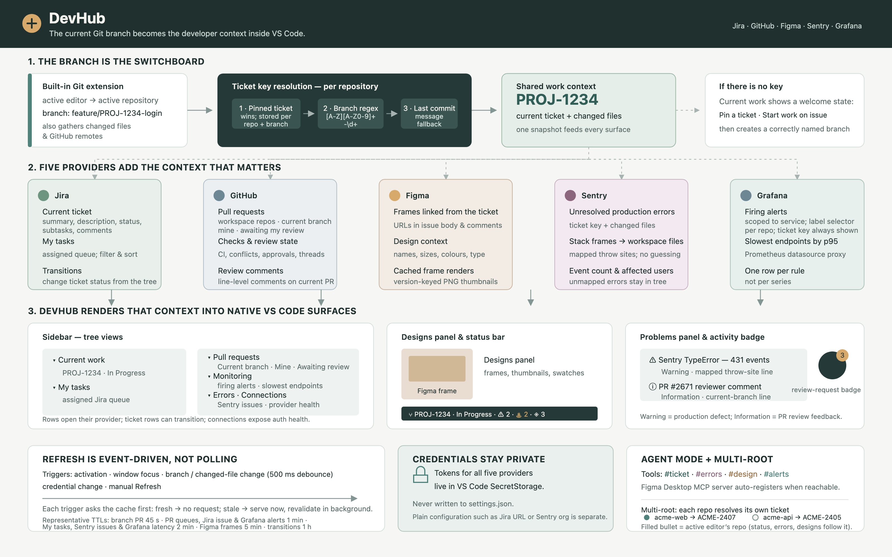

# DevHub

Jira, Figma, Sentry and Grafana in one VS Code sidebar, keyed off the branch you're on.

Check out `feature/PROJ-1234-fix-login` and DevHub shows the Jira issue, the Figma frames linked from it, the Sentry errors touching the files you changed, and a status bar line that summarises all of it. **My tasks** sits alongside it with everything else assigned to you.

[](resources/overview.svg)

## Run it

```bash
npm install
npm run compile
```

Then press **F5** in VS Code (or run `code --extensionDevelopmentPath=$PWD`). A second window opens with DevHub loaded.

To install permanently:

```bash
npm run package        # produces devhub-0.1.0.vsix
code --install-extension devhub-0.1.0.vsix
```

## Connect services

Run **DevHub: Connect a service…** from the command palette. Each one asks for the settings it needs and then a token, which is stored in VS Code's secret storage — never in `settings.json`.

| Service | What you need |
|---|---|
| Jira | Site URL, account email, an [API token](https://id.atlassian.com/manage-profile/security/api-tokens) |
| Figma | A [personal access token](https://www.figma.com/developers/api#access-tokens) |
| Sentry | Organization slug, an [auth token](https://sentry.io/settings/account/api/auth-tokens/) with `project:read` and `event:read` |
| GitHub | A [token](https://github.com/settings/tokens) with `repo`, plus `read:org` for organization repositories |
| Grafana | Your Grafana URL, and a [service account token](https://grafana.com/docs/grafana/latest/administration/service-accounts/) with the Viewer role |

The **Connections** view in the sidebar shows the health of each. Right-click a row to act on it: a connected service offers **Clear credentials**, one that isn't offers **Connect a service…**.

Clearing asks for confirmation, then offers to reconnect straight away. Where a service also needs plain settings — the Jira site URL and email, the Sentry organization — you get a second button, **Clear token and settings**, which resets those too so you're asked for them again. Tokens live in secret storage and deleting one can't be undone.

## How ticket detection works

1. A pinned ticket (**DevHub: Pin ticket…**) always wins. Pins are stored per repository *and* per branch — one pin for the whole workspace would keep overriding detection on every branch you moved to, and it outranks the branch name, so the wrong ticket would stay sticky until you noticed.
2. Otherwise the branch name is searched for `[A-Z][A-Z0-9]+-\d+` (configurable via `devhub.ticketKeyPattern`).
3. Otherwise the last commit message is searched.

If none match, the sidebar shows a welcome screen with a pin button and **Start work on issue…**, which picks from your Jira queue and creates a correctly named branch.

### More than one repository

A multi-root workspace has no single answer to "what am I working on" — the frontend can sit on one ticket's branch while the backend sits on another. So **Current work** resolves every repository in the workspace independently and shows a group per repository that has a ticket:

```
● acme-web      fix/ACME-2407-dashboard-checkin-height
    ACME-2407  Dashboard check-in height
    In Progress
○ acme-api       fix/ACME-2405-lesson-chapter-no-levels-500
    ACME-2405  Lesson chapter 500
    In Review
```

The filled bullet is the repository the active editor is in — the one the status bar, the error list and the designs panel are talking about, since those still follow the active repository.

Repositories with no ticket on their branch aren't listed; they have no current work. With a single ticket in the active repository the view stays flat, because a lone group header is pure indentation. A single ticket in some *other* repository is still grouped, so it never looks like it belongs to the branch you're on.

Ticket keys are deduplicated before fetching, so a frontend and a backend on branches for the same ticket costs one request, and each key is cached separately.

Rows act on their own ticket: opening or transitioning a row under `acme-api` uses that repository's ticket, not the active one.

## My tasks

Everything assigned to you, independent of the branch you're on. Each row reads `KEY · Summary`, with the status and how long ago it changed on the right; the icon is the priority — a red chevron up for the urgent end of your Jira priority scheme, a blue chevron down for the quiet end. Click a row to open it in Jira, expand it for its subtasks, right-click for **Change ticket status…**.

```
EVULPO-2460 · Align the learning path…      In Progress · 14m ago
EVULPO-2455 · Clicking "mark as checked"…   In Review · 3h ago
```

A row can't wrap, and it's the right-hand side that gets pushed off the end of it — so the summary is clamped to `devhub.rows.titleLength` (40 characters by default; `0` never clamps) and the status and age get the rest. The full summary is always in the tooltip. Without the clamp a long summary took the whole row and hid both of the fields you were scanning for.

Two controls in the view header:

- **Filter tasks by status…** — a multi-select list of the statuses actually present in your tasks, each with a count. Selecting none (or all of them) shows everything.
- **Sort tasks…** — priority highest first (the default), priority lowest first, recently updated, or issue key.

Both are remembered across sessions, and the view header shows where you are: `12 · Priority ↓`, or `5/12 · Priority ↓` when a filter is on.

Priority order comes from your site's own priority scheme (`/rest/api/3/priority`), so a `Blocker → Trivial` scheme sorts as correctly as the default `Highest → Lowest` one. If that call fails, DevHub falls back to ranking the well-known names. Tasks with no priority set always sort last, in both directions.

The list is what this JQL returns:

```jsonc
{
  // open tasks, plus anything you finished in the last fortnight
  "devhub.jira.tasksJql": "assignee = currentUser() AND (statusCategory != Done OR resolutiondate >= -14d) ORDER BY updated DESC",
  "devhub.jira.tasksLimit": 100
}
```

The status filter can only offer statuses that this query returned, so widen it if you want to filter over more. Its `ORDER BY` doesn't matter — sorting happens in the view.

Results are cached for two minutes and revalidated in the background, so switching branches costs no requests. **DevHub: Refresh** always refetches.

### Copying a task as a prompt

Every row has a clipboard button that copies the ticket as a ready-to-paste instruction — useful for handing a ticket to a coding agent without retyping the same preamble. It defaults to a two-stage *investigate, report a confidence score, wait for a green flag, then implement* prompt.

Override it with `devhub.tasks.promptTemplate`:

```jsonc
{ "devhub.tasks.promptTemplate": "Read ${url} and summarise the acceptance criteria." }
```

`${url}`, `${key}`, `${summary}`, `${type}` and `${status}` are filled in from the row. An unrecognised placeholder is left as written, so a typo shows up in the pasted text rather than silently deleting a line. Leave the setting empty for the built-in default.

Because both prompt settings default to empty, the Settings UI opens them on a blank box, and changing one sentence would mean retyping the whole prompt. **DevHub: Edit copy prompt…** avoids that: pick a button and it writes the prompt currently in use into the setting, then opens it — so you edit rather than rewrite. Once a prompt is overridden the same command offers to reset it back to the built-in text. An override already in workspace settings is edited where it lives rather than being promoted to a user-wide one.

The same command works from the palette as **DevHub: Copy prompt for task**, where it uses the current branch's ticket.

## Pull requests

Three groups, all scoped to the GitHub repositories open in your workspace:

- **Current branch** — the pull request for the branch you're on, expandable for its CI checks.
- **My open pull requests** — everything you have open, minus the branch one above.
- **Awaiting my review** — where someone has requested your review.

Each row reads `#2671  Title`, then the state, the age, and the repository:

```
#2712  Align the learning path…   Approved · 14m ago · evulpo/evulpo-frontend
#2709  Clicking "mark as chec…    Checks failing · 2h ago · evulpo/evulpo-frontend
#2725  Sticky player chrome…      Conflicts · Changes requested · Checks failing · 3h ago · evulpo/evulpo-frontend
#2688  Rework the audio cache…    Awaiting review · 6d ago · evulpo/evulpo-api
```

The description is ordered by what you would look for, because a row clips from the right: the state it's in, then how long it has been in it, then whose it is (in the review queue), then which repository. The title is clamped to `devhub.rows.titleLength` — 40 characters by default, `0` to never clamp — so that the first of those always has somewhere to go; the full title is in the tooltip.

Two states is the row's budget, but it's a budget for the *informational* ones. **Conflicts**, **Changes requested** and **Checks failing** are never dropped to stay under it: a row that says "Conflicts · Changes requested" while quietly omitting that the build is also red reads as a complete account and isn't one, and those three are the reason you'd open the pull request at all. So #2725 above names all three and gives up "3 unresolved" instead. The tooltip always names every state.

The states, in the order they take precedence — the first one applicable is the row's icon, the blocking ones always show in the description, and all of them in the tooltip:

| State | Means | Blocking |
|---|---|---|
| **Conflicts** | won't merge without a rebase | yes |
| **Changes requested** | a reviewer asked for work | yes |
| **Checks failing** | CI is red | yes |
| **_n_ unresolved** | open review threads, resolved ones excluded | |
| **Approved** | ready to merge | |
| **Checks running** | CI hasn't finished | |
| **Awaiting review** | waiting on someone else | |
| **Draft** | not asking for review yet | |

Conflicts lead because they block every other outcome: an approved pull request that won't merge still needs a rebase before anything else can happen to it. A draft never shows as "awaiting review".

**Sort pull requests…** in the view header offers recently updated (the default), least recently updated, newest and oldest, applied to both queues and remembered across sessions. Rows show the timestamp the sort is keyed on, so the order you picked is legible. The header reads `13 · Updated`, and the count of pull requests awaiting your review appears as a badge on the DevHub icon in the activity bar.

### How the scope works

Repositories come from the built-in Git extension's list, not from `workspace.workspaceFolders` — a folder can hold several repositories, a repository can be opened above or below its folder root, and worktrees appear as their own entries. Worktrees of the same repository are collapsed, so a repo with three worktrees is queried once.

Only `github.com` remotes are matched by default. For GitHub Enterprise set `devhub.github.baseUrl` to `https://your-host/api/v3`; the GraphQL endpoint and the remote host to match are both derived from it.

Both queues come back in **one GraphQL request**. REST can't do this: its search results carry neither `mergeable` nor `reviewDecision`, so the conflict state alone would cost an extra request per pull request. The repository scope is applied twice — as `repo:` qualifiers in the search when they fit inside GitHub's 256-character query limit, and always against the response — so adding a seventh repository degrades to a slightly larger response rather than to a rejected query.

### Why "conflict" sometimes takes a moment

GitHub computes mergeability lazily: the first request for a pull request it hasn't recently merge-tested returns `UNKNOWN` and *starts* the calculation, so the answer only exists once you ask twice. DevHub re-asks a few seconds later, at most twice, and only while some pull request still has no answer — there's no timer running once they all do. Until then the row simply shows no conflict state, and the tooltip says why.

### Copying a review as a prompt

Rows under **Awaiting my review** have a clipboard button that copies the pull request as a ready-to-paste instruction — the counterpart to the one in My tasks. It defaults to a prompt that reviews the PR, gathers independent findings, folds them into one review and submits it as yours.

Override it with `devhub.github.reviewPromptTemplate`:

```jsonc
{ "devhub.github.reviewPromptTemplate": "Summarise the risk in ${url} in three bullets." }
```

`${url}`, `${repo}`, `${number}`, `${title}`, `${author}` and `${key}` are filled in from the row. `${key}` is the ticket key found in the pull request title, falling back to the current branch's; it renders empty when there is none, whereas an unrecognised placeholder is left as written. Leave the setting empty for the built-in default.

It needs a row, so it isn't offered in the command palette.

### Copying one of your own as a prompt

Rows under **My open pull requests** have their own clipboard button — the mirror of the review one. That button is for someone else's work; this one is for yours coming back with changes requested, a conflict or a red build.

It defaults to a prompt that reads the review threads, the diff and the failing jobs with `gh`, checks out the branch, addresses every unresolved comment, rebases if it conflicts, fixes what CI is failing on, pushes, and replies to each thread as you.

The pasted text opens by naming what the row named:

> Update https://github.com/evulpo/evulpo-frontend/pull/2725 using gh. It is currently blocked on: Conflicts · Changes requested · Checks failing. Read the review threads with `gh pr view 2725 --repo evulpo/evulpo-frontend --comments`, …

Override it with `devhub.github.updatePromptTemplate`:

```jsonc
{ "devhub.github.updatePromptTemplate": "Fix ${state} on ${url}, then push." }
```

`${url}`, `${repo}`, `${number}`, `${title}`, `${state}` and `${key}` are filled in from the row. `${state}` is the row's own description of what is blocking it, so the prompt carries the state you were looking at when you clicked; it reads "nothing — check whether it is ready to merge" when the pull request is clean. `${key}` behaves as it does in the review prompt.

**DevHub: Edit copy prompt…** offers all three prompts, and a reset for each one you've overridden.

Review comments on the current branch's pull request also appear in the Problems panel, on the lines they were left on, at Information severity — Sentry's production errors are warnings, so the two stay tellable apart. Clicking a comment row jumps to the line in your working tree; if the comment isn't on a line, it opens on GitHub instead.

Results are cached for two minutes and revalidated in the background, so the queues are on screen from the moment the view opens and stay there while they update. **DevHub: Refresh** always refetches; nothing polls on a schedule.

```jsonc
{
  "devhub.github.enabled": true,
  "devhub.github.baseUrl": "https://api.github.com",
  "devhub.github.limit": 50   // per queue
}
```

The token needs `repo` (and `read:org` for organization repositories).

## When it refreshes

Nothing polls on a schedule. A refresh happens on window focus, on a branch or changed-file change (debounced 500 ms), when credentials change, on activation, and on **DevHub: Refresh**.

Those triggers fire far more often than the data changes — a save is one, and so is every alt-tab — so three gates stand between a trigger and a request:

1. **The refresh interval.** A trigger that repeats the context of the last round waits out `devhub.refresh.minIntervalSeconds` (15 s by default; `0` disables it), and only the last trigger inside the window gets a round. A context that actually moved — a different branch, repository or ticket — never waits.
2. **In-flight joining.** A trigger that asks for exactly what a running round is already fetching waits for that round instead of cancelling it. Cancelling and re-issuing was how a burst of saves could keep a request in permanent restart while the sidebar sat on "Loading…".
3. **The cache**, below. A round that finds every entry fresh touches the network not at all.

Whether a refresh reaches the network is decided by the cache, not by the trigger:

| Data | Cached for |
|---|---|
| Branch pull request | 90 s |
| Pull request queues | 2 min |
| Jira issue | 60 s |
| My tasks | 2 min |
| Sentry issues | 2 min |
| Sentry event frames | 5 min |
| Figma file | 5 min |
| Grafana alerts | 1 min |
| Grafana latency | 2 min |
| Jira transitions | 1 h |
| Jira priorities | 24 h |

So alt-tabbing back into the editor usually costs no requests at all. A stale entry is served immediately and refreshed behind it, and identical loads of the same key collapse into one request.

None of that shows a spinner. A view replaces its rows with "Loading…" only when it has nothing else to put there — no rows yet, and its provider has not answered for the branch you are on — which means the first load, and a branch switch to something not yet fetched. Every refresh after that leaves the rows alone: they are at most one interval stale, which beats an empty view. The pull request view says `refreshing…` in its header while a round runs, and only redraws its rows when they have actually changed, so nothing you have expanded collapses under you.

An empty section is also never guessed at. "You have no open pull requests" appears only once GitHub has answered for the current context; until then the section says it is still loading, and a failure says so with a link to the logs.

**DevHub: Refresh** drops the volatile cache entries, ignores the refresh interval and refetches — it is the button for when you are watching a CI run rather than working. **DevHub: Clear cache** empties everything, including the Figma renders on disk.

## Sentry path mapping

Stack frames arrive as `app:///src/x.ts` or `webpack://app/./src/x.ts`. DevHub strips the common prefixes automatically; for anything else, add rewrites:

```jsonc
"devhub.sentry.pathMappings": [
  { "from": "webpack://acme/./", "to": "" }
]
```

Frames that can't be resolved to a real file are dropped rather than guessed. If errors show in the tree but no squiggles appear, the mapping is wrong — check **DevHub: Show logs**.

### Narrowing to one environment

`devhub.sentry.environment` restricts every query to a single environment:

```jsonc
{ "devhub.sentry.environment": "production" }
```

Empty (the default) means all environments.

### When a frame won't resolve

Frames are resolved against an index of the workspace's source files, not just the files you changed — a production error usually lives in code your branch never touched. The index is capped at 5000 files and cached for five minutes.

If an error still shows up with no clickable location, **DevHub: Diagnose Sentry path mapping…** writes a frame-by-frame account to the log:

```
ACME-4  TypeError: cannot read property 'id' of undefined
repoRoot: /Users/you/code/acme-web

app  app:///src/auth/login.ts:42  →  /Users/you/code/acme-web/src/auth/login.ts
app  app:///src/lib/session.ts:8  →  unresolved
lib  node_modules/react/index.js:1  →  skipped (not app code)
```

It uses the same inputs as the real resolution, so it explains what actually happened rather than what would happen under different settings. An `unresolved` app frame means `devhub.sentry.pathMappings` needs a rewrite for that prefix.

## Monitoring

Grafana answers the question the Errors view answers, from the metrics side: is the service you're working in holding up. Two groups.

**Firing alerts** — one row per alert rule, not per series, because a rule alerting on forty pods is one thing being wrong. Rows read `Rule name` with the severity, series count and how long it's been going:

```
Checkout p99 above SLO      critical · 3 series · for 2h
Queue depth climbing        warning · for 18m
Cache hit ratio             Pending · warning · for 4m
```

Firing sorts above pending, then by severity, then longest-burning first — an alert that has been up all morning outranks the one that started while you were reading. Clicking a row opens the rule in Grafana.

**Slowest endpoints** — p95 per route for the same service, over the last hour:

```
POST /checkout      1.24 s
GET  /cart           840 ms
GET  /search         410 ms
```

Clicking one opens it in Grafana Explore. The query that produced the row is in its tooltip, so a row that looks wrong can be checked — and pasted, if a future Grafana stops honouring the Explore link format.

Firing alerts also show in the status bar (`$(flame) 2`) and turn it amber, the same way errors in your changed files do.

### Which alerts are yours

Alerts are scoped to the service the current repository *is*. Map that explicitly:

```jsonc
{
  "devhub.grafana.services": {
    "acme-web": "service=web, env=prod",
    "acme-api": "service=api"
  }
}
```

Only equality matchers are supported. A `!=` or `=~` matcher is dropped rather than coerced into an equality it doesn't mean — quietly turning "not web" into "web" would scope the view to exactly the alerts you excluded.

A repository with no mapping falls back to matching its own name against `devhub.grafana.serviceLabels` (`service`, `app`, `job`, `namespace` by default), trying `acme-web`, `acme_web` and the like. That guess matches loosely — any of those labels carrying any of those spellings — because guessing narrowly just hides alerts. A mapping you wrote matches strictly, on every matcher, because you wrote it.

On top of either, an alert whose labels or annotations mention the current branch's ticket key is always shown: wiring a ticket key into an alert is an explicit statement that it belongs to that work.

The empty state says which rule it applied, so "nothing is wrong" and "nothing matched your selector" don't look the same — and when alerts are firing that your scope excluded, it says how many and offers **DevHub: Fix alert scope…**, which lists the labels those alerts actually carry and writes the mapping from what you pick. That needs no network: it reads the fetch already in hand.

### The latency query

**DevHub: Set up latency query…** does this for you, and is the fastest way through it. It lists the Prometheus datasources the token can see, asks which metric measures request duration and which label names the endpoint, writes the query, and then checks whether the service scope actually matches anything — offering to fix that too when it doesn't. It also sits on the Monitoring view's title bar, and on the row you get when the query comes back empty.

It offers two shapes of metric. A histogram (`*_bucket`) gives a real p95. A bare `_sum`/`_count` pair gives a mean, marked as such in the picker and ranked below any histogram — a mean hides the tail that makes latency interesting, but it beats an empty panel and it is what that data can support.

### When there are no latency metrics at all

Plenty of stacks ship access logs and no metrics. If the datasource has nothing to compute a duration from, the setup flow offers **Try Loki logs** and builds the query from log lines instead: pick a stream, and it samples 25 recent lines, works out whether they are JSON or logfmt, and offers the numeric fields as the duration and the text fields as the route — ranked so `duration` and `path` come first, and with the unit guessed from how big the numbers are.

```logql
topk(${limit}, quantile_over_time(0.95, {job="acme/api"} | json | unwrap duration [${window}]) by (path))
```

Nested JSON is flattened with an underscore, the way LogQL's own parser does, so the field names offered are the ones the query will see. `devhub.grafana.latency.datasourceKind` records which language the stored query is in.

One difference from the metrics path: for logs the stream selector *is* the service, so `${selector}` isn't substituted and the query is pinned to the stream you picked.

To do it by hand, set the datasource and, if the default doesn't fit your metrics, the query:

```jsonc
{
  "devhub.grafana.latency.datasourceUid": "prom-prod",
  "devhub.grafana.latency.window": "1h",
  "devhub.grafana.latency.limit": 5
}
```

The built-in query is a starting point, not a promise — metric names vary too much for a default to be right everywhere:

```promql
topk(${limit}, histogram_quantile(0.95, sum by (le, route)
  (rate(http_server_request_duration_seconds_bucket{${selector}}[${window}]))))
```

`${selector}` is the scope above rendered as PromQL, `${service}` is the repository name, and `${window}` and `${limit}` come from the settings. An unrecognised placeholder is left as written, so a typo surfaces as a query Grafana rejects rather than a silently emptied one.

The row label is read from whichever of `route`, `path`, `endpoint`, `handler`, `operation`, `uri`, `url`, `target` or `job` the series carries, so regrouping the query doesn't leave every row reading "unknown".

Everything goes through Grafana's datasource proxy, so the Prometheus behind it needs no separate credentials or network route.

## Using it with agent mode

DevHub registers four language model tools: `#ticket`, `#errors`, `#design` and `#alerts`. Reference them in chat, or let agent mode call them on its own:

> Implement the acceptance criteria in #ticket, matching the colours in #design.

> Is anything in #alerts related to what I just changed?

If the Figma desktop app is running with its MCP server enabled, DevHub registers it automatically — no `mcp.json` editing.
